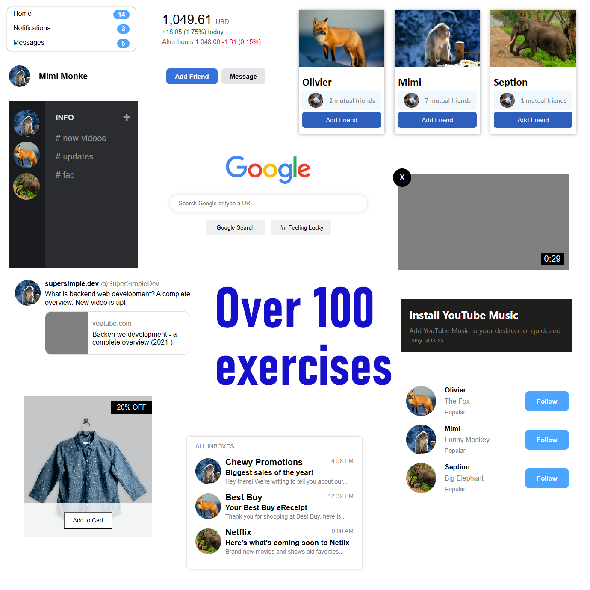

# YouTube copy *and exercises*
### 
This is my own faithful copy of YouTube 2022 main page what I made using HTML and CSS.

# Over 100 exercises
### 
I did it to improve my HTML and CSS skill. I copied a design from popular services like Twitter. What you can see at second branch called **exercises**.

## My copy is a little diffrent
### 
I added additionaly tooltip for channels.

## Super addition
I created a reponsive design depending on current screen width.

## I did it through this course

### 
> Photos and many icons are from Google ©2022
